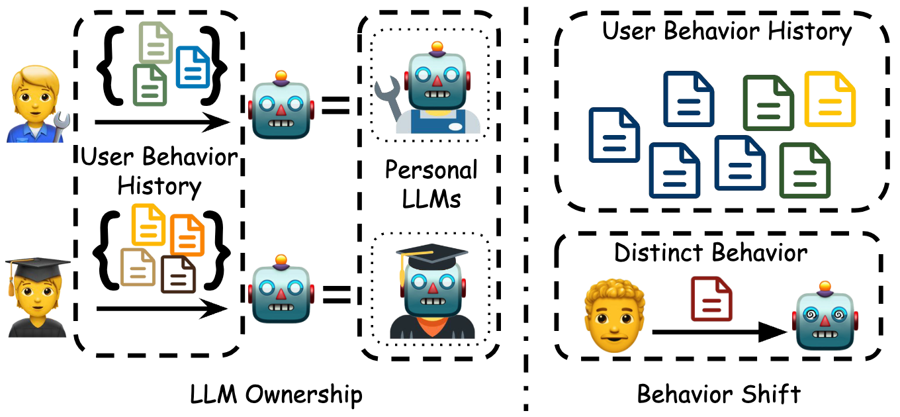
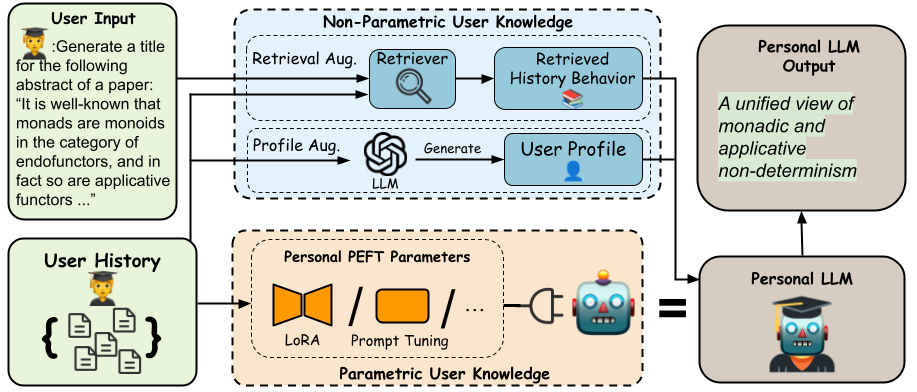

# Democratizing Large Language Models via Personalized Parameter-Efficient Fine-tuning


This is source code of our EMNLP 2024 paper

[**Democratizing Large Language Models via Personalized Parameter-Efficient Fine-tuning**](https://arxiv.org/abs/2402.04401).

by
[Zhaoxuan Tan](https://zhaoxuan.info/), 
[Qingkai Zeng](https://qingkaizeng.github.io/), 
[Yijun Tian](http://tianyijun.com/), 
[Zheyuan Liu](https://franciscoliu.github.io/), 
[Bing Yin](https://scholar.google.com/citations?user=qSOxydEAAAAJ&hl=en), 
[Meng Jiang](http://www.meng-jiang.com/).


## Overview ##

* **Ownership**: Existing methods are processed centralized, where user history is encoded in a personalized prompt and processed by centralized LLMs. This paradigm limits the model's customization and ability to provide deep, personalized experiences tailored to individual users. Moreover, when using a centralized model, users often have to share personal data with the service provider, which raises concerns about how user data are stored, used, and protected.

* **Behavior Pattern Generalization**: As is revealed by existing research, LLMs can be easily distracted by irrelevant context information that retrieval can hardly avoid. In LLM personalization, where the retrieval corpus is confined to a specific user's behaviors, retrieval augmentation might underperform, especially when the user's past behaviors do not closely mirror the patterns needed for the query at hand.

<div  align="center">    

</div>

Personalization in large language models (LLMs) is increasingly important, aiming to align the LLMs' interactions, content, and recommendations with individual user preferences. Recent advances have highlighted effective prompt design by enriching user queries with non-parametric knowledge through behavior history retrieval and textual profiles. However, these methods faced limitations due to a lack of model ownership, resulting in constrained customization and privacy issues, and often failed to capture complex, dynamic user behavior patterns. To address these shortcomings, we introduce One PEFT Per User (OPPU), employing personalized parameter-efficient fine-tuning (PEFT) modules to store user-specific behavior patterns and preferences. By plugging in personal PEFT parameters, users can own and use their LLMs individually. OPPU integrates parametric user knowledge in the personal PEFT parameters with non-parametric knowledge from retrieval and profiles, adapting LLMs to user behavior shifts. Experimental results demonstrate that OPPU significantly outperforms existing prompt-based methods across seven diverse tasks in the LaMP benchmark. Further studies reveal OPPU's enhanced capabilities in handling user behavior shifts, modeling users at different activity levels, maintaining robustness across various user history formats, and displaying versatility with different PEFT methods.

<div  align="center">    

</div>

## Dataset ##

We use publicly available data from the [LaMP](https://arxiv.org/abs/2304.11406) benchmark. You can download the our processed data [here](https://drive.google.com/file/d/1bJ3Rh_sqrw3suwwweFbra5CTV7GVjgxF/view?usp=sharing), unzip it, and place it under the ```./data``` folder


## Installation ##
Please install the dependencies via conda, using the following command:

```bash
pip install -r requirements.txt
```

## Experiment ##
```task_name``` can be selected from ```[citation, movie_tagging, news_categorize, news_headline, product_rating, scholarly_title, tweet_paraphrase]```. Here, we take ```movie_tagging``` as an example.

### OPPU
#### 1. Base LLM Task Adaption

```bash
CUDA_VISIBLE_DEVICES=0 python task_LoRA.py --k 0 --task_name movie_tagging
```

#### 2. Train One PEFT Per User
```bash
CUDA_VISIBLE_DEVICES=0 python OPPU.py --k 0 --task_name movie_tagging --task_lora ./ckpt/movie_tagging/k0-movie_tagging-Llama-2-7b-hf-task_LoRA_ckpt
```

### OPPU + RAG

#### 1. Base LLM Task Adaption

```bash
CUDA_VISIBLE_DEVICES=0 python task_LoRA.py --k 1 --task_name movie_tagging
```

#### 2. Train One PEFT Per User
```bash
CUDA_VISIBLE_DEVICES=0 python OPPU.py --k 1 --task_name movie_tagging --task_lora ./ckpt/movie_tagging/k1-movie_tagging-Llama-2-7b-hf-task_LoRA_ckpt
```
----

### OPPU + PAG
#### 1. Base LLM Task Adaption

```bash
CUDA_VISIBLE_DEVICES=0 python task_LoRA.py --k 1 --task_name movie_tagging --add_profile
```

#### 2. Train One PEFT Per User
```bash
CUDA_VISIBLE_DEVICES=0 python OPPU.py --k 1 --task_name movie_tagging --task_lora ./ckpt/movie_tagging/k1-movie_tagging-Llama-2-7b-hf-profile-task_LoRA_ckpt --add_profile
```

## Evaluation ##
```TASK_ID``` is the corresponding ID selected from ```["LaMP_1", "LaMP_2N", "LaMP_2M", "LaMP_3", "LaMP_4", "LaMP_5", "LaMP_7"]```

```bash
python ./eval/eval_task.py \
    --golds_json {PATH_TO_LABEL_JSON_FILE} \
    --preds_json {PATH_TO_PREDICTION_JSON_FILE} \
    --task_name {TASK_ID} \
    --output_file {RESULT_JSON_PATH}
```

## Citation ##
If you find this paper or codebase useful in your research, please kindly cite the following paper.

```bibtex
@article{tan2024democratizing,
  title={Democratizing Large Language Models via Personalized Parameter-Efficient Fine-tuning},
  author={Tan, Zhaoxuan and Zeng, Qingkai and Tian, Yijun and Liu, Zheyuan and Yin, Bing and Jiang, Meng},
  journal={arXiv preprint arXiv:2402.04401},
  year={2024}
}
```
